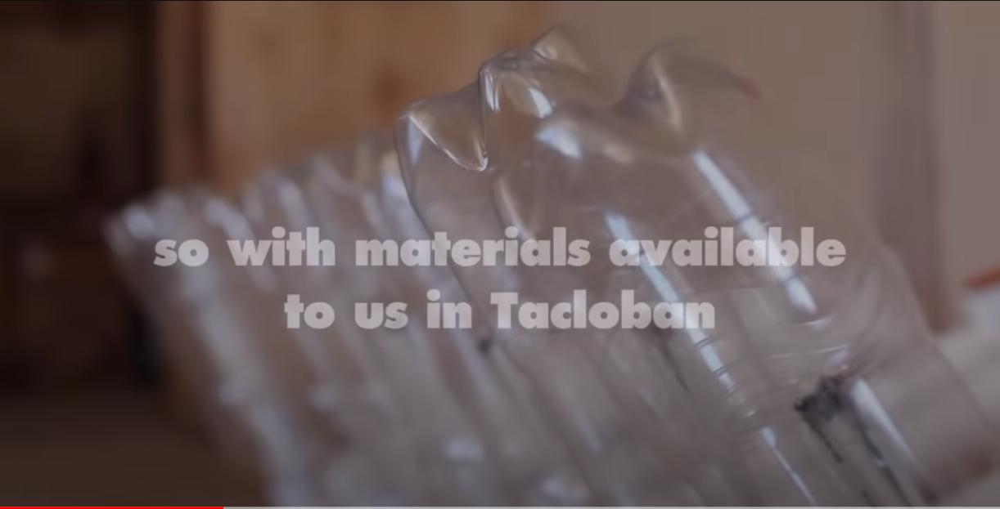
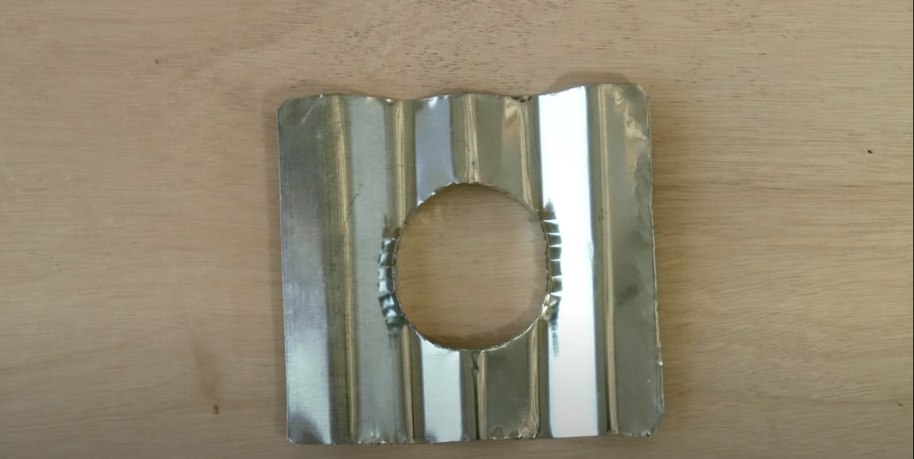
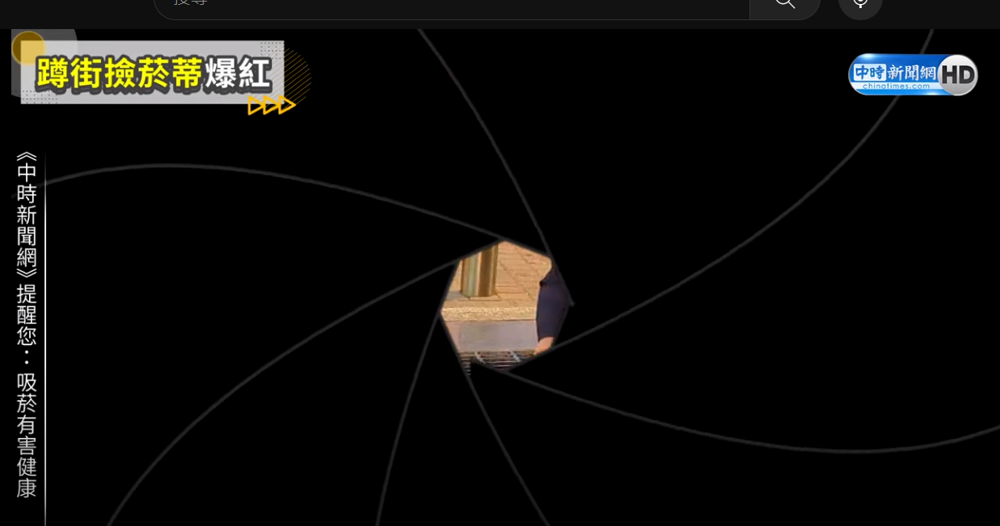
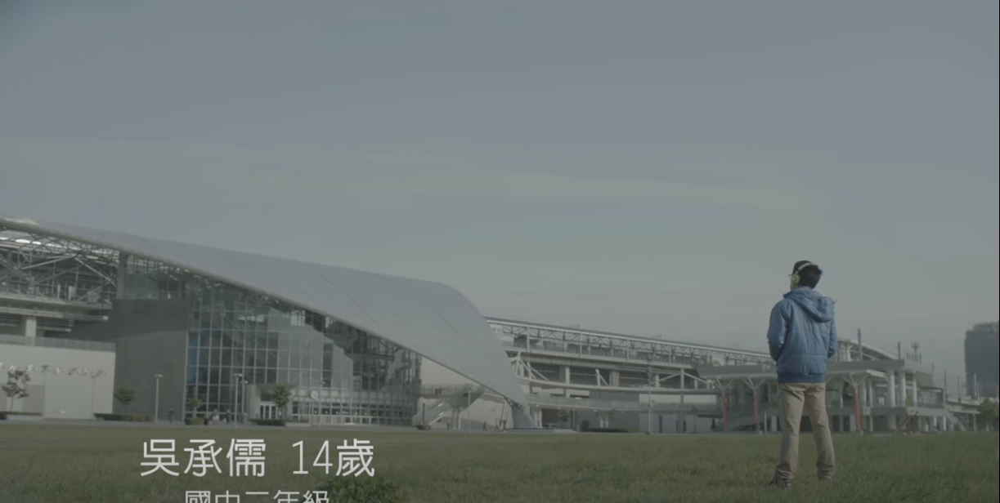

##   高中生的科學計算

科學研究中所需要的資訊能力

以物理系如何利用資訊能力做基礎研究為例

### use Science to solve Social problems 

- problem -- Liter of Light At Night Case Study Video | Pepsi | BBDO Guerrero

- solution -- How to Build a Solar Bottle Bulb 2.0 ( Updated English Version

#### Taiwan Cases: 

- 南一中學生蹲街撿菸蒂爆紅　安平區「淨街」2h結果超驚人 

- 吳承儒：高鐵上的小科學家

### vPython Introduction and Examples 

- [vPython-Glowscript](https://www.glowscript.org/)

#### HTML && Javascipt Tutorial  

- [HTML Tutoirial](https://www.w3schools.com/html/default.asp)

- [Javascipt Tutorial](https://www.w3schools.com/js/)
 

### Case Study

- [足球物理學：不可能的自由球 - Erez Garty](https://www.youtube.com/watch?v=m57cimnJ7fc)

- [第三屆台大物理模擬程式競賽__優選作品：撞球](https://www.youtube.com/watch?v=F-bvkL5kEdk)
